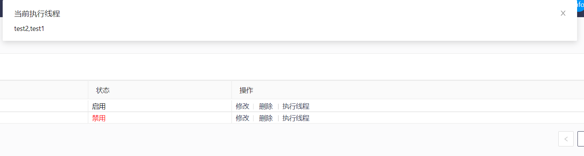

# InfoCenter
基于kafka的内部信息化队列消费者平台。主要用于中小型公司的业务解耦合。高并发没压测尝试过- -！

首先需要感谢xuxueli老师的XXLjob平台的一些启发，以及xiajunsongfan的zkClient的帮助。

* 现状分析：在目前很多公司的信息化软件中存在着如下问题： 
  * 1.系统太多，分布太散，因为人员离职等情况，以及年代久远，文档遗失，很多的消费者服务之后都找不到了，或者需要花费很多的功夫去找这些消费者服务。 
  * 2.很多的消费者目前可能还是自己写在一个web服务里启动个线程去操作，这样如果web站点出了问题，消费者服务也会拖垮。或者写在控制台等程序里，这样就会出现一堆的控制台程序。或者很多消费者写在一 个服务里去处理，因为你不相干的业务可能导致整体崩溃。 
  * 3.开发水平残次不齐，很多信息化部门的开发可能根本没有接触过队列。

综上原因，开发了一套基于http调用的的kafak队列消费者平台，开发者只需要按照格式要求写好http接口，直接配置入平台中就能完成消费者的功能，同时因为配置接口地址的原因，对应的服务能够很轻松的找到部署在哪。

# 概览
目前项目中主要分三个站点和一个core
* admin-center 用于配置中心的配置服务，以及监控consumer端是否下线
* admin-font 为前端配置页，基于react+antd4.0,运行需要有node环境
* info-consumer 为具体的consumer执行端
* info-core 为封装的一些类，如zk的操作等
* 以demo结尾的项目为使用例子


# zk和kafka的一些配置
* kafka
  建议关闭topic的自动创建以及允许删除，通过配置中心去创建以及删除
  ```shell script
  auto.create.topics.enable=false
  delete.topic.enable=true
  ```
* zk中如果按照默认程序配置目前分为三个大节点
  * 1 /MqCenter/ConsumerList：info-consumer 启动时会往此节点注册一个临时节点，center通过监视这些节点来监控节点是否在线，如果掉线给出警报通知
  * 2 /MqCenter/ConTaskList：此节点下记录了每个info-consumer中应该执行的消费任务，以及具体的任务信息如下：
  ```shell script
  [zk: xxx.xxx.xxx.xxx(CONNECTED) 7] ls /MqCenter/ConTaskList/Node1
  [test1, test2]
  [zk: xxx.xxx.xxx.xxx(CONNECTED) 8] get /MqCenter/ConTaskList/Node1/test1
  {"batchNumber":10,"execCode":"Node1","getType":"2","groupName":"kafka.test.group1","hea_int_ms":1000,"max_poll_ms":30000,"notifier":"xxxx@mail.com","offsetReset":"latest","operateOutTime":10000,"operateType":"restful","operateUrl":"http://localhost:6903/consumer/trysuccess","par_assign_strategy":"range","ses_timeout_ms":10000,"taskCode":"test1","taskStatus":1,"topicName":"kafka.test"}
    ```
  目前在Node1（Node1什么意思见后续说明）节点下有两个任务交test1和test2，get可以看到test1中具体执行任务的清单
  * 3 /MqCenter/WorkList：此节点下记录了每个info-consumer中实际在执行的消费者任务线程，名称为后续消费者设置中设置的任务编码。
* kafka和zk建议搭建为3台机器的集群，保证服务的可用性

# admin-center
* 配置
```yml
project:
  env: dev
server:
  port: 6900
  tomcat:
    max-http-form-post-size: -1
zookeeper:
  address:  #ZK连接地址 格式如111.111.111.111:10086 后面不需要加上根目录路径
  rootnode: /MqCenter  #ZK节点根目录
  actConsumer: /MqCenter/ConsumerList #当前运行的消费者执行器根节点，此处如果有消费者接入，会创建临时节点，同时center会监视是否掉线
  conTaskList: /MqCenter/ConTaskList #每个Consumer中具体的执行任务
  workList: /MqCenter/WorkList #每个Consumer中具体的执行线程

spring:
  datasource:
    url: #数据库地址 jdbc:mysql://111.111.111.111:3306/info_mq_center?useUnicode=true&characterEncoding=UTF-8&autoReconnect=true&serverTimezone=Asia/Shanghai
    username: #数据库连接账号
    password: #数据库连接密码
    driver-class-name: com.mysql.cj.jdbc.Driver
  mail:
    host: #邮件服务器地址 如：smtp.qq.com
    port: 465
    username: #发邮件的账号
    password: #邮件密码
    properties:
      mail:
        smtp:
          auth: true
          starttls:
            enable: true
            required: true
          socketFactory:
            class: javax.net.ssl.SSLSocketFactory
  kafka:
    bootstrap-servers: #kafaka连接地址 111.111.111.111:9093

mybatis:
  type-aliases-package: info.mq.admincenter.model
  mapper-locations: classpath:/mybatis-mapper/*Mapper.xml

errormailer: #如果有消费者节点掉线时的邮件通知人 aaa@mail.com
```
* 1 请按照如上配置指引配置好zk，kafka地址，程序运行必要的节点（如未在zk中创建，启动center时程序自动创建），以及数据库配置
* 2 通知消息的宽展：只需要实现DoAlarm接口，程序会自动触发，具体实现可参考程序中alarm/impl目录下例子。此处因为不存在并发，在处理时为顺序执行，如果有洁癖可以自行改为多线程
* 3 启动程序

# admin-font
* 启动需要建立在Node环境的基础上,还有安装yarn,然后在前端项目根本录yarn install 安装必要的组件
* 配置 修改src/axios/config目录下如下配置，此处配置为admin-center服务的地址
```js
/*
 * 接口地址配置文件
 */ 
const ServerUrl = 'http://localhost:6900';
```
* 启动项目，点击admin-font根目录下的 启动文件.bat 默认端口为6872

* 执行器管理配置
  *界面如下，点击新增执行器进行新增

  * Code指的是每个info-consumer中的mynode配置，需要唯一，且新增后不可修改
  * 执行器地址目前无实际用途，主要是为了帮助让你找到这个消费者节点具体挂在哪台服务器上了
  * 名称用来给这个节点定个标识
  * 状态用来控制节点是否启用，如果后续info-consumer需要更新发布时建议先关闭节点，然后等执行线程为空时再kill然后发布
  
    * 当前执行器节点正在运行的任务线程
  

* topic管理
  * 界面如下，点击新增topic
  
  * 此处分区数和副本数不懂的话建议百度( ╯□╰ )，此处就不叙述了，这边平台不支持扩充分区数，需要自己去服务器上扩充
  
  * 点击查看可以看到topic的一些信息
  
  * 注：一旦创建之后就无法被修改了，如果出现无法删除topic的情况，请检查上述文章中的kafka两个参数是否配置
  
* 消费者管理
  * 界面如下，点击具体topic，增加消费者组和消费者任务，如果topic在kafka中确实存在，状态才会显示为可用
   
  * 创建消费者组
    * kafka中同一消费组是不能重复消费的
    * OffsetReset是指第一次启动消费者组的时候哪边开始启动消费，详细见提示，目前支持earliest，latest，none三种
    * 分区策略指的是多分区，多消费者时对应分区的分配策略，建议选择stickey，标重点，因为开发的时候没那么多机器测试，所以这个参数有没有用不知道，不知道，不知道！！！重要的事情说三遍！！！！
    * 错误通知人指的是消费信息错误时会给哪些人发送邮件通知等提醒。
    * 因为如果消费者组一旦创建被执行后，kafka中实际是有记录的，为了防止删除后又新建了一个新的一模一样的消费者组，导致消费时看着数据不准，所以此处一旦创建不让删除，要删除需要手工处理
   
  * 创建消费者组下具体的消费任务 
    * 任务编码，唯一值，会在后台启动个任务线程，线程名称就是任务编码
    * 执行节点指的时对应任务运行在哪个Info-customer节点上
    * 获取方式有批量和单条，建议不要使用单条，此选项只是为了兼容此系统开发之前的老版本
    * 调用方式目前支持两种接口调用
      * 1 restful接口风格的post请求接口，详细使用请参考demo
      * 2 eureka注册中心的微服务接口，post
    * 调用地址 
      * 1 restful的如图直接写接口地址
      * 2 eureka写成 provider|/consumer/trysuccess provider指的是provider的spring.application.name，/consumer/trysuccess指的是对应的调用方法 中间'|'隔开，后台会通过ribbon的方式自动发现
    * 批消费数指的是每次消费拉取的数据数量
    * 超时时间 毫秒，指的是restTemplate在调用时如果多少时间没read回来说句就超时失败
    * heartbeat.interval.ms 毫秒，心跳时间，服务端broker通过心跳确认consumer是否故障，如果发现故障，就会通过心跳下发rebalance的指令给其他的consumer通知他们进行rebalance操作，这个时间可以稍微短一点
    * session.timeout.ms  毫秒，服务端broker多久感知不到一个consumer心跳就认为他故障了，默认是10秒
    * max.poll.interval.ms 毫秒，如果两次poll操作间隔超过了这个时间，broker就会认为这个consumer处理能力太弱，会将其踢出消费组，触发rebalance，将分区分配给别的consumer消费，此参数很重要！！！很重要！！！很重要！！！如果这个参数设置的小了，两次poll都超过了这个时间，会触发reblance（大概率会出现重复消费！！！亲测碰到过），遇到此类问题时要么批处理消费数改小，要么这个参数改大！！！！
    * 目前系统消费还不支持指定offset，指定时间，指定分区，延时队列，后续可能会扩充加入！！！，因为目前实际场景在信息化中没用到。特殊的场景也是自己手动写了个就关掉了。
    * 还有个问题，erueka的没怎么测试，可能调用会有BUG ( ╯□╰ )
   
* 错误消息
  任务处理出错的消息会自动增加到数据库中，这里可以忽略不考虑，或者点击重试再次推送如队列中
     

# info-customer
* 配置
```yml
project:
  env: dev
server:
  port: 6901
  tomcat:
    max-http-form-post-size: -1


zookeeper:
  address:  #ZK连接地址 格式如111.111.111.111:10086 后面不需要加上根目录路径
  rootnode: /MqCenter  #ZK节点根目录
  actConsumer: /MqCenter/ConsumerList #当前运行的消费者执行器根节点，此处如果有消费者接入，会创建临时节点，同时center会监视是否掉线
  conTaskList: /MqCenter/ConTaskList #每个Consumer中具体的执行任务
  workList: /MqCenter/WorkList #每个Consumer中具体的执行线程


mybatis:
  type-aliases-package: info.mq.infoconsumer.model
  mapper-locations: classpath:/mybatis-mapper/*Mapper.xml


spring:
  datasource:
    url: #数据库地址 jdbc:mysql://111.111.111.111:3306/info_mq_center?useUnicode=true&characterEncoding=UTF-8&autoReconnect=true&serverTimezone=Asia/Shanghai
    username: #数据库连接账号
    password: #数据库连接密码
    driver-class-name: com.mysql.cj.jdbc.Driver
  mail:
    host: #邮件服务器地址 如：smtp.qq.com
    port: 465
    username: #发邮件的账号
    password: #邮件密码
    properties:
      mail:
        smtp:
          auth: true
          starttls:
            enable: true
            required: true
          socketFactory:
            class: javax.net.ssl.SSLSocketFactory
  kafka:
    bootstrap-servers: #kafaka连接地址 111.111.111.111:9093
  #基于eureka注册的微服务，没有的话可以排除
#  application:
#    name: Node1


#基于eureka注册的微服务，没有的话可以排除

eureka:
  client:
    enabled: false #此处使用时记得改为true 打开
#    service-url:
#      defaultZone: http://euk.com:6904/eureka/
#provider:
#  ribbon:
#    NFLoadBalancerRuleClassName: com.netflix.loadbalancer.RoundRobinRule


mynode: Node1  #当前执行的节点，对应执行器管理中的Code
```
* mynode这个节点很关键，就是对应上述配置中执行器管理中的code，必须唯一，因为每次启动时会往ZK中注册临时节点，如果存在的情况下项目是启动不了的，注：如果你项目关闭了马上启动也会提示节点已存在，需要30S之后才能启动（默认session设置了30S过期）
* 每次消费如果超时或者直接返回给error，会把当前拉取的消息全部写入到errorlist中，所以可能存在人为手动点击多次触发的情况，所以提供的消费者接口一定要做最终幂等！！！不要省事！！！
* 前端页再次推送的时候ack为-1，因为正常这里手动点没并发，保证数据99%写道队列中！
* 启动eureka时需要把改有的注解都打开，该有的配置都打开，没有就不用管
* consumer端的功能扩充
  * 1 错误消息通知 只需要继承如下接口，并且托管给spring，就能实现具体的调用
  ``` java
  /**
   * 对错误消费的mes的后续处理
   * @param consumerResult   消费处理结果
   * @param task  具体执行任务的参数
   * @return
   */
  public interface DoErorAlarm {
      boolean doErrorAlarm(ConsumerResult consumerResult, Consumer_Task task);//对于错误消费的后续处理
  }

  ```
  例子：此处没写具体的实现，如果你是钉钉等只要实现这个就行了，如果你发邮件啥不要，直接把这个接口干掉就不会调用了
  
  ``` java
   @Component
   public class ErrorSendWeChat implements DoErorAlarm {
       @Override
       public boolean doErrorAlarm(ConsumerResult consumerResult, Consumer_Task task) {
           System.out.println("我是微信消息");
           return true;
       }
   }
  ```
  * 2 调用方法的扩充
    * 此处在调用时用到了InvokeProxy动态代理，如果想在调用前或者调用后干点啥可以写在这。举个例子，直接把调用日志结果同步到哪，或者像这里错误消费的处理就是写在这
    * 新增的调用类别需要继承如下接口，同时在CustomerFactory中去封装一些特定的参数，以及new实例
      ``` java
      //执行消费接口
      public interface Invoked {
          /**
           *
           * @param records   kfaka拉取到的message
           * @param restTemplate  封装好的restTemplate
           * @param task 具体的执行任务
           * @return
           */
          ConsumerResult invoke(ConsumerRecords<String, String> records, RestTemplate restTemplate, Consumer_Task task);
      }

      ```
# info-restful-consumer-demo 
消费者接口的例子，首先接收的消息需要接收如下实体类
```java
public class ConsumerMessage {
    private String topicName;//消费的的topic
    private String message;//具体的messge list转成的String

    public String getTopicName() {
        return topicName;
    }

    public void setTopicName(String topicName) {
        this.topicName = topicName;
    }

    public String getMessage() {
        return message;
    }

    public void setMessage(String message) {
        this.message = message;
    }

    @Override
    public String toString() {
        return "{" +
                "topicName='" + topicName + '\'' +
                ", message=" + message +
                '}';
    }
}
```
返回参数
```java
public class ConsumerResult {
    private int code; //200 成功 其他失败
    private String messgae;//返回的消息，如果有错误消息就返回错误消息，没有就返回空
    private String errorMessage;//批处理时消费失败的message封装成list后再转的String

    public int getCode() {
        return code;
    }

    public void setCode(int code) {
        this.code = code;
    }

    public String getMessgae() {
        return messgae;
    }

    public void setMessgae(String messgae) {
        this.messgae = messgae;
    }

    public String getErrorMessage() {
        return errorMessage;
    }

    public void setErrorMessage(String errorMessage) {
        this.errorMessage = errorMessage;
    }

    @Override
    public String toString() {
        return "{" +
                "code=" + code +
                ", messgae=" + messgae +
                ", errorMessage=" + errorMessage +
                '}';
    }
}
```

具体执行，另外eureka不写了，道理一样
```java
@RestController
@RequestMapping(value = "/consumer")
public class ConsumerController {
   /*
    * 1 JSONObject.parseObject(message.getMessage(),ArrayList.class);
    * 在此处处理时要把消息先转会List<String>再去处理，为什么不直接传递的情况是实际测试如果是json，message的字符串会默认增加双引号
    * 同理，错误的message返回时也要把List集合转为String
    * 2 post请求
    */


    //测试成功消费
    @RequestMapping(value = "trysuccess", method = RequestMethod.POST)
    public ConsumerResult cunsumerSuccess(ConsumerMessage message) {
        ConsumerResult resultMsg = new ConsumerResult();
        ArrayList<String> messageList=JSONObject.parseObject(message.getMessage(),ArrayList.class);
        messageList.forEach(x->{
            System.out.println(x);
        });
        resultMsg.setCode(200);
        return resultMsg;
    }

    //测试消费失败
    @RequestMapping(value = "tryerror", method = RequestMethod.POST)
    public ConsumerResult cunsumerError(ConsumerMessage message) {
        ConsumerResult resultMsg = new ConsumerResult();
        ArrayList<String> messageList=JSONObject.parseObject(message.getMessage(),ArrayList.class);
        messageList.forEach(x->{
            System.out.println(x);
        });
        resultMsg.setMessgae("测试消费错误.......");
        resultMsg.setErrorMessage(JSONObject.toJSONString(messageList));
        resultMsg.setCode(500);
        return resultMsg;
    }

    //测试接口超时
    @RequestMapping(value = "trytimeout", method = RequestMethod.POST)
    public ConsumerResult cunsumerTimeOut(ConsumerMessage message) throws Exception {
        ConsumerResult resultMsg = new ConsumerResult();
        ArrayList<String> messageList=JSONObject.parseObject(message.getMessage(),ArrayList.class);
        messageList.forEach(x->{
            System.out.println(x);
        });
        resultMsg.setCode(200);
        Thread.sleep(30000);
        return resultMsg;
    }
}
```
# db
打开项目中的DB文件夹，点击Sql,创建数据库

# 调用架构图
   

# 一些运行时的优化建议
* 消费者接口一定要做幂等！！！！
* 如果真的出现了生产消息大于推送的情况，可以尝试再建几个topic去分发，然后再消费
* 如果想完全保证顺序消费，目前平台只能让topic建立一个分区，然后一个consumer去消费
* 目前生产消费这块都是没有鉴权的，很干净。如果对于安全性比较高的可以自己扩充，如果安全性不要求那么高，内网环境下ipsec也没问题了。
* 消费者节点如果要发布，一定要先下线，等执行线程没了，再kill，保证任务顺利完成
* 错误消费的后续通知目前用的是线程池，修改此方法ErrorRejectHandler，自己接入通知，可以再如果错误消息通知线程池沾满的情况下即使通知你调整线程池的参数
* 在和.net等平台对接调用时可能会出现有些特殊字符需要转义的情况，举个例子，实际场景就碰到过一次用postman正常，但是在用.net调用java上述写的demo例子生产者时，因为内容里有'%'，直接消息体为null了。

```shell script
如果执行时出现如下错误 rebuild project
Error:Kotlin: Module was compiled with an incompatible version of Kotlin. The binary version of its metadata is 1.5.1, expected version is 1.1.16.
```

# 后续版本会优化
1. 会加入如果连续消费出错任务自动下线
2. 增加手动前台推送消息
3. 错误消息体定时删除
